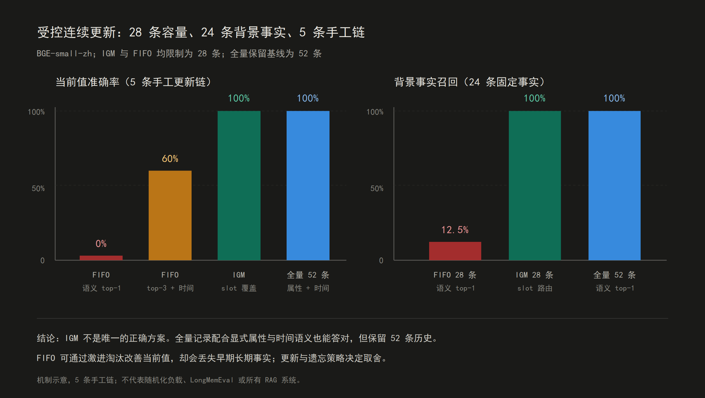
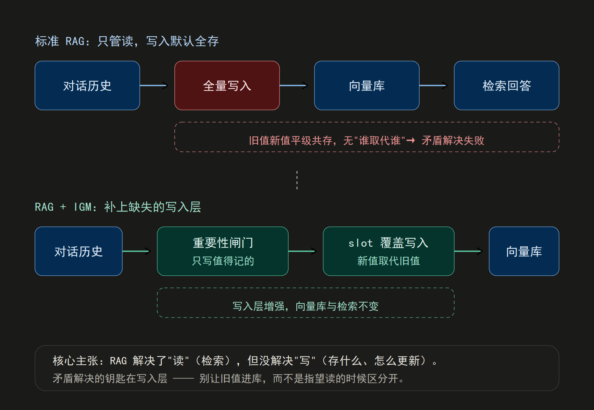

# Selective Retention

关于"重要性驱动的选择性保留"的研究代码和实验：从持续学习的参数保护，到 Agent 记忆的写入层（IGM，Importance-Gated Memory / 重要性门控记忆）。

**配套长文**：[《我试图让 AI 学会"不遗忘"，撞了三次墙后搞明白的三件事》](docs/ARTICLE_DRAFT.md)

## 结论（TL;DR）

下面每条都附了可复现的出处：

1. **梯度 hook 冻不住参数。** AdamW 的解耦权重衰减和历史动量在梯度为零时照样移动参数（实测 drift 9.94e-5）。要在优化器层对实际 delta 做投影才能真冻住（drift = 0）。
2. **同一套"重要性筛选 → 执行层强制保留/淘汰"的结构，在参数空间（FIP/GPP）和信息空间（IGM）都出现过——但这目前是假说，不是结论。** 两侧各自有效果实验，还没有实验检验"同一结构可迁移"这件事本身；把它当成方向提示可以，当成已证结论不行。
3. **知识更新应同时区分状态和版本。** 破坏性 IGM 当前值为 100% 但历史值为 0%；归档式覆盖（原 Versioned IGM）把门控后的 32 个事实事件与 28 个当前状态引用分开，在两个 500 条 BGE 合成负载中当前与历史均为 100%。该语义现已是 `igm` 与 DSH 插件的默认行为，破坏性覆盖降为显式选项 `supersede="delete"`。这验证了架构的行为，不证明它胜过版本化 RAG；而且真实数据一侧（[结论 7](docs/LONGMEMEVAL_STALE_LEAK_AND_READER.md)）已经给出它的准确率上界——把"只留当前值"做到完美也只有 58.8%，低于免费的时间序组装，所以这一层的价值要按压缩、token 成本与可审计性来论证。
4. **持续适应需要结果反馈，而不是假装模型已在线训练。** OutcomeMemory 以不可变成功/失败事件和衰减证据视图修正经验；在全信息和“只能观察已执行动作”的概念漂移负载中均能恢复，但与等价的衰减统计基线完全一致。[协议与边界](docs/OUTCOME_FEEDBACK_MEMORY.md)
5. **结果反馈也必须分来源。** 已明确标记为低可信的污染反馈会按较低权重进入证据视图；这只在来源标签可信时有效，不能当作自动防提示注入。[污染实验](docs/OUTCOME_FEEDBACK_MEMORY.md#污染反馈验证来源标签必须进入证据权重)
6. **RAG 负责把新措辞映射到经验情境，但路由是风险面。** 单一 BGE prototype 在 32 条校准探针上为 93.75%，在另一组 32 条手工留出探针上只有 75.0%；top-1/top-2 间隔拒答可减少一部分错误，但仍会高置信度错路由。[语义情境路由验证](docs/SEMANTIC_CONTEXT_ROUTING.md)
7. **真实数据上，"当前值"的失败主要发生在读侧的排序，而不是召回——而且改顺序就能修，比写入层还便宜。** LongMemEval-S 的 knowledge-update 题里正确证据几乎总能召回（英文 BGE，`recall_all@10` = 98.31%），但按相似度排出的顺序把陈旧值放在当前值之前——top-1 63.9%、top-10 内 61.1%（72 条两证据题，中英编码器都复现）。用本地 4B reader 做答案级对照（有效行准确率，n=72）：只给陈旧证据 **4.4%**；同一组 8 条证据 newest-first **13.8%**（比任意相似度序还差）；相似度序（现状）**41.3%**；只给当前值（完美写入层的上界）**58.8%**；同一组证据改时间序 **65.2%**；oracle **66.7%**。**操作层面的结论**：把证据按时间升序组装、最新一条放最后，值约 24pp（n=72，单 4B reader），且不输理想写入层。**机制层面没有定论**：用 `--analyze-report` 做了三个位置假设的检验，"照抄最后一条"与"新旧两条的相对先后"都被推翻，只有"含答案那条排第 1 位时准确率更低"（33% vs 60%，p≈0.06）是弱信号——效应是真的，但不是任何单一位置规则，最可能的解释是语篇连贯性，未验证。同时修正一个旧结论的口径：换英文 BGE 后整体 `recall_all@10` 从 86.91% 升到 93.98%，k=10 上 user-only 与 role-aware 双双饱和，旧结论的 +0.52pp 看着"归零"实为天花板效应，角色路由的收益转移到了排序（整体 `recall_all@1` +1.05pp，目标题型 single-session-assistant 的 `@1` 从 86.05% 升到 95.35%）。[陈旧值泄漏与 reader 评测](docs/LONGMEMEVAL_STALE_LEAK_AND_READER.md)
8. **slot 机制是"事实库写入层"，不是通用对话记忆层——换 LLM 抽键也救不回来。** 把中文关系模式直译成英文，在 LongMemEval-S 的 122,416 条自然 user turn 上命中 61 次（0.05%），72 组新旧证据对里新旧两侧抽到同一键的有 **0** 组。把抽取器换成模型（本地 4B、逐 turn 单独喂、不看问题，即真实写入期约束）后，键复用从 0/72 升到 **11/72（15.3%）**；43% 的证据对有一侧**根本抽不出键**——那侧的提及没有给属性命名（"I've tried four different ones so far"），任何抽取器都需要跨句推断才知道属性是什么。阈值放宽到 0.70 也只有 27.8%，且开始把不同属性误合并。**瓶颈不是抽取器能力，是自然更新经常不给属性命名。** [写入层自然文本覆盖度与 LLM 键抽取](docs/LONGMEMEVAL_STALE_LEAK_AND_READER.md)

## 受控连续更新实验

同一属性被连续更新 5 次（新旧值语义近似），问“当前值”。500 条随机化 BGE 负载使用两个 seed；下表列 seed 1337，完整方法和边界见[公平消融与负载扫描](docs/MEMORY_DECISIVE_LOAD_SWEEP.md)：

| 方法（BGE，28 条容量条件） | 当前值准确率 | 历史值准确率 | 持久化事件/记录 | 当前投影 |
|---|---:|---:|---:|---:|
| 原始全量，语义 top-1 | 22.8% (114/500) | - | 52 | 52 |
| 原始全量，属性过滤 + 时间排序 | 100% (500/500) | 100% | 52 | 52 |
| 门控但保留版本，属性过滤 + 时间排序 | 100% (500/500) | 100% | 32 | - |
| 破坏性 IGM（slot 覆盖） | 100% (500/500) | 0% | 28 | 28 |
| **Versioned IGM（事件 + 当前视图）** | **100% (500/500)** | **100%** | **32** | **28 个事件引用** |



图中是原始 5 条手工链的机制示意，不能当作 500 条负载的统计图。破坏性 IGM 的问题是删除旧版本；实验原型 Versioned IGM 以当前状态视图指向事件库，避免该数据损失。完整设计、原始数据和边界见[公平消融与负载扫描](docs/MEMORY_DECISIVE_LOAD_SWEEP.md)及[Versioned IGM 架构与验证](docs/VERSIONED_IGM_ARCHITECTURE.md)。

破坏性 IGM 不是替代 RAG，而是装在 RAG 前面的写入层（重要性闸门 + slot 覆盖），向量库和嵌入都不动。Versioned IGM 则把覆盖改为“事件归档 + 当前状态视图”：



## 复现

```bash
# 500 条随机化机制负载与同容量 FIFO 对照（不调 LLM）
python -m memory_arch.run_decisive --embed-backend bge \
  --background-facts 24 --full-capacity 28 \
  --random-trials 500 --updates-per-chain 5 --seed 1337 \
  --output reports/memory-decisive-random500-bge.json

# 训练写入打分器（权重可解释，held-out ≈ 0.956）
python -m memory_arch.train_scorer

# slot 抽取 OOD 回归（同时写出 JS parity 测试读的 oracle，不调 LLM）
python -m memory_arch.run_slot_ood --output reports/slot-ood-baseline.json

# 结果反馈记忆：验证新结果是否能修正陈旧经验（不调 LLM）
python -m memory_arch.run_outcome_drift \
  --seeds 200 --contexts 32 --output reports/outcome-feedback-drift.json

# 部分反馈 + 探索：每轮只能看自己实际执行动作的结果
python -m memory_arch.run_outcome_bandit \
  --seeds 400 --contexts 32 --output reports/outcome-feedback-bandit.json

# 已标记污染反馈下的来源加权验证
python -m memory_arch.run_outcome_poison \
  --seeds 400 --contexts 32 --output reports/outcome-feedback-poison.json

# RAG 将新措辞路由到 canonical context，再读取结果经验（需本地 BGE）
python -m memory_arch.run_semantic_transfer \
  --seeds 500 --min-margin 0.02 --probe-set calibration \
  --output reports/semantic-transfer-bge.json
python -m memory_arch.run_semantic_transfer \
  --seeds 500 --min-margin 0.02 --probe-set evaluation \
  --output reports/semantic-transfer-bge-evaluation.json

# LongMemEval-S：只评 session 级证据是否进入 top-k，不评生成答案正确性
python -m memory_arch.longmemeval_retrieval \
  --input /path/to/longmemeval_s_cleaned.json \
  --output reports/longmemeval-s-bge-role-aware-test.json \
  --embed-model /path/to/bge-small-zh-v1.5 \
  --partition test --role-aware

# M0 基线对比（需要本地 LLM）
python -m memory_arch.run_m0 --methods naive_rag igm --embed-backend bge
```

嵌入模型 [BGE-small-zh](https://modelscope.cn/models/BAAI/bge-small-zh-v1.5) 要单独下载（HuggingFace 网络受限用 ModelScope）。本地 LLM 基线用 [qwen3:4b](https://ollama.com/library/qwen3)（GGUF）。

## 作为库用（igm）

`igm/` 是可 pip 安装的零依赖写入层，接进 RAG 系统：

```python
from igm import Memory

mem = Memory()
mem.add("我的住址是北京。")
mem.add("更新一下，我的住址现在是深圳了。")   # 北京那条关闭有效期，进归档
mem.query_texts("我现在的住址是什么？")         # -> 只有深圳
mem.previous("住址").text                       # -> 北京（历史仍可答）
```

这是归档式覆盖：读侧永远只看到当前值，被取代的版本留在事件库里可查。只要当前状态、不想让归档增长，用 `Memory(supersede="delete")` 恢复旧的破坏性语义。Versioned IGM 的原始原型（`memory_arch/versioned.py`）已删除，其语义即 `igm/store.py` 的默认实现，详见 [igm/README.md](igm/README.md) 和 [架构与验证](docs/VERSIONED_IGM_ARCHITECTURE.md)。

## 作为 DeepSeek Harness 插件用（dsh-igm-memory）

同一套机制做成了 DSH 插件，给 agent 加“闸门 + 覆盖 + 分域持久记忆”：

- `remember_fact`：agent 记事实走 IGM 闸门，同属性新值覆盖旧值
- `recall_fact` + 会话启动注入：新会话开局能看到此前记住的事实；每次召回都会更新复用计数
- `recall_history`：问"之前/上一次 X 是什么"时返回该属性的归档版本时间线
- `fact / decision / experience` 显式分类；只有经验能按主题跨项目复用
- 按工具调用自己的 session cwd 路由，跨进程重启仍能发现项目存储
- JSON 持久化 + 基于最后使用时间的 consolidate 遗忘

插件与库共用归档式覆盖：同属性的旧值被关闭有效期后仍留在 JSON 存储里，但不再进入召回、跨项目匹配和会话启动注入；`recall_history` 工具负责答"之前是什么"。

```sh
dsh plugin --profile web add ./dsh-igm-memory
dsh web   # 重启加载
# 会话里：记住我的住址是北京 → 改记住是深圳 → 新会话问"我住址是哪" → 答深圳
#          再问"那之前住哪？" → recall_history 答北京
```

代码在 `dsh-igm-memory/`，详见 [dsh-igm-memory/README.md](dsh-igm-memory/README.md)。

## 仓库结构

```
igm/                    # 可安装的 RAG 写入层库（零依赖核心）
  memory.py             #   Memory 门面：add / query / history / consolidate
  gate.py               #   WriteGate：重要性闸门 + slot 提取
  store.py              #   MemoryStore：事件归档 + 当前投影 + 遗忘生命周期
  embedders.py          #   可插拔嵌入（hash / BGE / 自定义 callable）
  test_igm.py           #   26 个单元测试
dsh-igm-memory/         # DeepSeek Harness 插件（cordis bundle）
  lib/index.js          #   remember_fact / recall_fact / recall_history / 注入 / 持久化 / 遗忘
  cordis.patch.yml      #   插件注册层
  test/test_igm_plugin.mjs #  27 个插件回归测试，含 slot 规则跳语言 parity（npm test）
memory_arch/            # Agent 记忆研究代码（IGM 的实验负载）
  scorer.py             #   可学习的 importance 打分器
  outcome.py            #   结果事件归档 + 衰减证据视图
  context_router.py     #   RAG 文本 -> canonical experience context
  longmemeval_retrieval.py # LongMemEval-S session 证据检索与角色感知读侧
  slot_ood.py           #   模板外措辞的带标注语料（误抽 / 漏抽 / 键漂移 / 碰撞）
  run_decisive.py       #   受控更新实验：归档式与破坏性覆盖的消融
  run_outcome_drift.py  #   受控概念漂移：结果反馈如何修正经验
  run_outcome_bandit.py #   部分反馈 + 探索：经验如何在真实约束下适应
  run_outcome_poison.py #   污染反馈：来源权重如何限制低可信证据
  run_semantic_transfer.py # RAG 路由如何影响结果经验复用
  run_slot_ood.py       #   slot OOD 回归与 JS parity oracle
  run_stale_leak.py     #   LongMemEval-S 陈旧值泄漏：top-k 内的新旧排序
  run_write_coverage.py #   写入层在自然文本上的命中率与键稳定性
  run_llm_keys.py       #   LLM 写入期抽键：键复用率与每 turn 成本
  run_reader_eval.py    #   reader-in-the-loop：证据顺序对答案的影响
  run_m0.py             #   M0 基线评估 runner
fip/                    # 持续学习：FIP / GPP 参数保护
  optimizer.py          #   FeatureMaskedAdamW：优化器层 delta 投影
  non_ffn_protection.py #   NonFFNProtector：逐行重要性保护
experiments/            # 持续学习实验 runner（phase0 等）
examples/               # quickstart.py 等示例
docs/                   # 文章、研究报告、配图（PNG/SVG）
reports/                # 原始实验结果 JSON（可审计）
```

## 文档导航

- **文章**：[docs/ARTICLE_DRAFT.md](docs/ARTICLE_DRAFT.md)
- 记忆架构：[研究方案](docs/MEMORY_ARCHITECTURE_RESEARCH_PLAN.md) · [M0 报告](docs/MEMORY_M0_REPORT.md) · [状态与版本](docs/VERSIONED_IGM_ARCHITECTURE.md) · [结果反馈](docs/OUTCOME_FEEDBACK_MEMORY.md) · [语义情境路由](docs/SEMANTIC_CONTEXT_ROUTING.md) · [LongMemEval-S 检索](docs/LONGMEMEVAL_S_RETRIEVAL.md) · [陈旧值泄漏与 reader 评测](docs/LONGMEMEVAL_STALE_LEAK_AND_READER.md)
- 持续学习：[FIP 终局决策](docs/FIP_PHASE0_FINAL_DECISION.md) · [GPP 提案](docs/GPP_PROJECT_PROPOSAL_V0.md) · [Split MNIST 报告](docs/SPLIT_MNIST_REPORT.md)

## 边界

- 研究线状态：**活跃**的是 IGM 写入层（事实库语义）与读侧评测（陈旧值泄漏、顺序效应）；**已关闭**的是结果反馈（结论 4/5，与衰减统计基线完全一致）和语义情境路由（结论 6，留出集 75%）——负结论已拿到，不再投入，文档保留作记录。slot 规则的适用边界见结论 8。
- 实验在受控合成数据上做的，记忆基线是 4B 本地模型。方向可信，绝对数字别当真。
- 500 条实验仍由有限的手工属性、值池和中文模板生成；LongMemEval-S 一侧已有英文编码器复跑、陈旧值泄漏测量与本地 4B reader 的臂间对照（[报告](docs/LONGMEMEVAL_STALE_LEAK_AND_READER.md)）。reader 是 4B 本地模型且明显偏弱（控制组 20.8%），因此只读**臂间差异**、绝对准确率不可与榜单比较；该实验也没有接官方 QA 评审器。不能外推成通用 RAG 结论。
- 标准 RAG 够用时别加这层。IGM 的价值是“只要当前状态”时的压缩和冲突消除；历史版本不再需要另接版本库，默认实现就是事件归档 + 当前投影。
- IGM 是 RAG 的增强件，不是替代品。
- 归档式覆盖的代价是事件库随同属性更新次数单调增长，只有 `consolidate` / `prune` 会物理清除低强度记录。只答当前值、且在意存储成本的调用方应显式用 `supersede="delete"`；读侧默认已过滤归档，不会因为保留历史而答错。
- slot 提取已从“任意锚点 + 系词”收紧为共享的关系模式：能处理 `改成`/`换成`/`搬到`/`叫`/`把…改成` 等实际更新表达，并拒绝感叹语、引述和瞬时事件。新的 OOD 回归（`memory_arch/slot_ood.py`）从原基线的非属性误抽 80%、命名属性键准确率 46% 改为 **0% / 100%**；这只是 10 条非属性、13 条命名属性的人工标注回归集，不是自然流量覆盖率。**而且这条规则在自然英文叙述上不成立**：直译成英文后在 12.2 万条真实对话 turn 上命中 0.05%，72 组新旧证据对零键复用（见[结论 8](docs/LONGMEMEVAL_STALE_LEAK_AND_READER.md)）。所以 IGM 目前的适用范围是"事实库写入层"——被主动陈述的状态（`我的X是Y`、项目约定、显式记住）；当成通用对话记忆层用，键会在前门就抽不出来。`memory_arch/__init__.py` 和嵌套 DSH fixture 复用/对齐 `igm/gate.py` 的规则，parity 测试继续防止实现漂移。

## License

[MIT](LICENSE)
